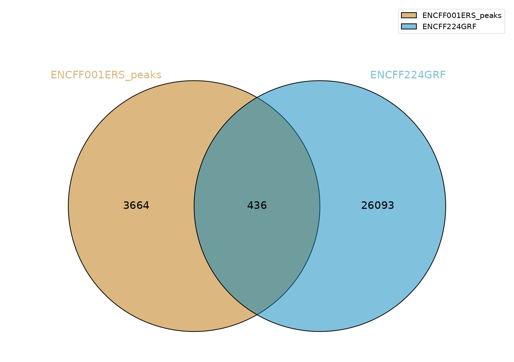
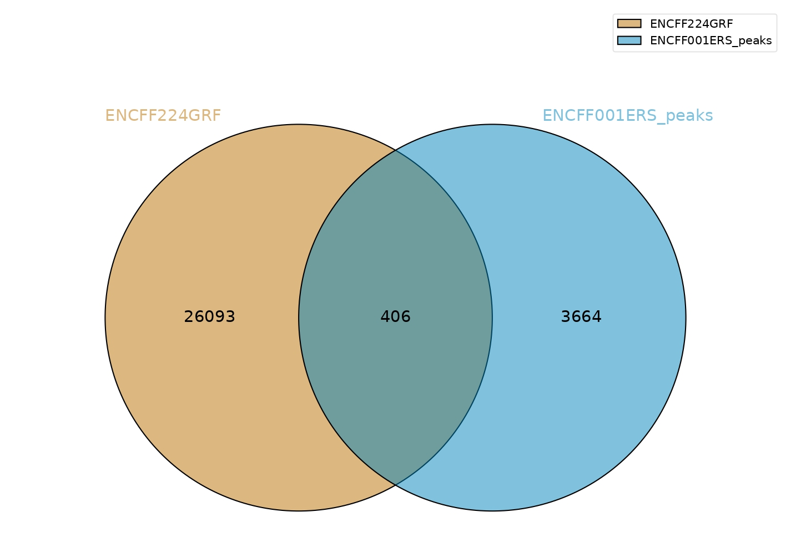
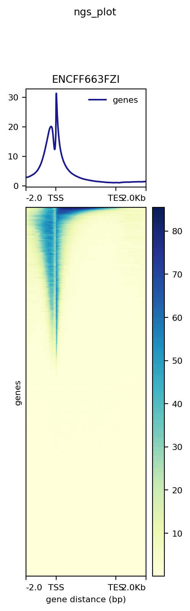

# hse_hw2_chip
Колаб: https://colab.research.google.com/drive/1XJSbxBadezVic9h9DIuUCZh02Te4fqR0#scrollTo=DAy5E9OllNda

| ChIP-seq    | Всего ридов | Не выровнялось    | Выровнялись уникально | Выровнялись      |
|-------------|-------------|-------------------|-----------------------|------------------|
| ENCFF001ERS | 14628082    | 13484293 (92.18%) | 316584 (2.16%)        | 827205 (5.65%)   |
| ENCFF001ESA | 23645904    | 22348575 (94.51%) | 427129 (1.81%)        | 870200 (3.68%)   |
| ENCFF001HAG | 19662696    | 16261782 (82.70%) | 791819 (4.03%)        | 2609095 (13.27%) |

Почему процент выравниваний получился именно таким?  
**Ответ**: В выдаче получился маленький процент выравнивания, так как хромосома, на которую мы выравнили, сама по себе маленькая в сравнении с полным геномом целовека.

## Venn diagrams

Как можно объяснить различия в количестве пересечений?  
**Ответ**: Скорее всего различия происходят из-за разного порядка накладывания одного на другое

## Бонусное задание
Как можно объяснить вид распределения и локализацию мод?
**Ответ**: Распределение похоже на логнормальное.

